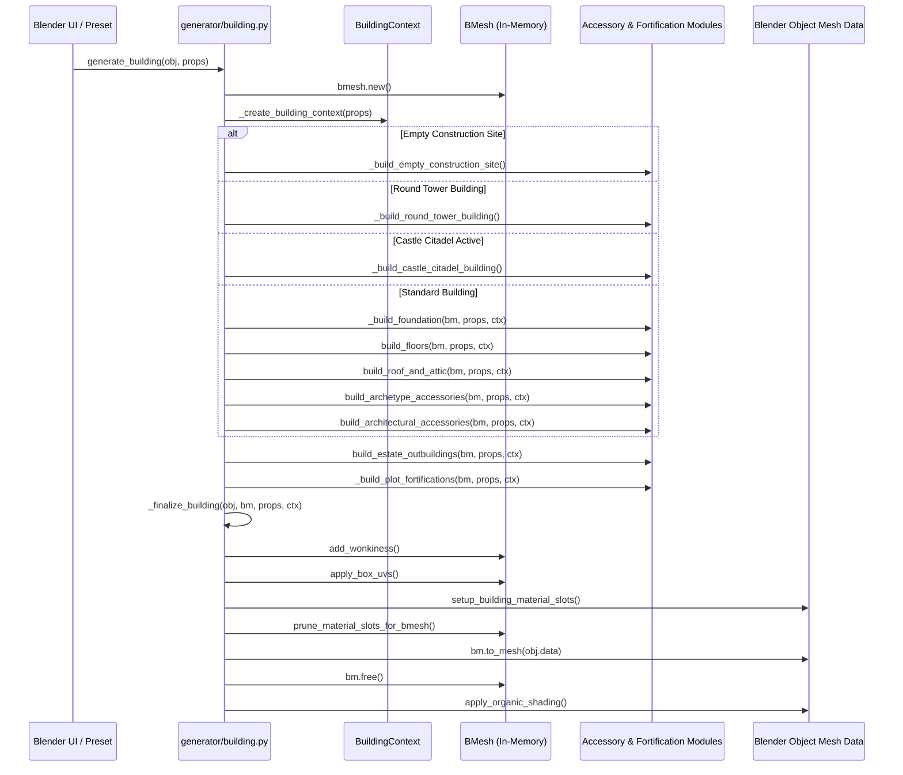

# Technical Architecture & Generation Pipeline

This document details the core technical design, pipeline execution sequence, data flow, coordinate conventions, and mesh finalization mechanisms in **BlendBuildingCreator**.

---

## 1. Architectural Philosophy

BlendBuildingCreator generates meshes dynamically using Blender's internal **BMesh** API. It avoids pre-modeled static modular tiles or boolean cutters. Instead, it constructs clean, continuous, manifold geometric primitives, cuts framed apertures mathematically, and stitches architectural components together in memory before committing to Blender mesh data.

### Key Tenets
1. **Parametric Proceduralism**: Building size, floor count, wall thickness, roof pitch, and accessory placement are computed dynamically from user properties (`properties.py`).
2. **Watertight Walkability**: Slabs, walls, stairs, and doors maintain consistent physical clearances for first-person or third-person navigation.
3. **Deterministic Reproducibility**: Variations, timber wonkiness, and accessory distribution are governed by a deterministic seed (`props.seed`).
4. **Draw-Call Optimization**: All generated sub-components share a canonical material indexing scheme. Unused slots are pruned at bake time.

---

## 2. Generation Pipeline Lifecycle

The primary entry point is `generate_building(obj, props)` located in `generator/building.py`.



---

## 3. The `BuildingContext` Object

Before any mesh construction occurs, `_create_building_context(props)` initializes a runtime container holding computed metrics:

```python
class BuildingContext:
    width: float           # Footprint width along X axis
    depth: float           # Footprint depth along Y axis
    floors: int            # Number of storeys (1-5)
    floor_height: float    # Individual floor clearance (typically 3.0m - 4.5m)
    foundation_height: float
    total_height: float    # foundation + (floors * floor_height)
    seed: int              # RNG seed
    tier: str              # 'TIER_1', 'TIER_2', or 'TIER_3'
    shape: str             # 'RECTANGLE', 'L_SHAPE', 'T_SHAPE', 'U_SHAPE', 'ROUND_TOWER'
    palette: dict          # Cached RGB colors for plaster, timber, stone, roof
```

---

## 4. Pipeline Execution Sequence

### Phase 1: Foundation & Footprint
- **Foundation Plinth** (`_build_foundation`): A beveled stone plinth grounded at $Z=0$ to accommodate terrain elevation differences.
- **Footprint Shapes** (`generator/shapes.py`, `generator/poly.py`):
  - `RECTANGLE`: Uniform four-corner box.
  - `L_SHAPE`: Main body with a perpendicular wing creating an inner corner.
  - `T_SHAPE`: Central stem with cross wings.
  - `U_SHAPE`: Courtyard-enclosing parallel wings.
  - `ROUND_TOWER`: Multi-faceted polygonal cylinder ($N=8$ to $N=24$).

### Phase 2: Floors, Jettying & Walls
- **Floor Slabs & Openings** (`generator/floors.py`): Creates interior floor decking with cutouts reserved for staircases and ladder hatches.
- **Cantilever Jettying**: Upper storeys can project outwards by $0.2\text{m} - 0.5\text{m}$ (either second-floor only or progressive every floor), supported by structural timber corbels.
- **Wall Panels** (`generator/walls.py`): Constructed as double-sided solid geometry with inward-facing interior plaster/timber and outward-facing exterior stone/timber.
- **Tudor Half-Timber Framing** (`generator/facade.py`): Structural corner posts, horizontal girts, diagonal braces, and window framing studs placed over exterior plaster.

### Phase 3: Openings (Doors & Windows)
- Cutout coordinates are registered in the context.
- **Doorways** (`generator/openings.py`): Stone surround arches or timber lintels, grounded threshold steps, and swinging door blades with customizable open/close angles.
- **Windows**: Recessed frames, stone sills, glass panes, cross mullions, and hinged shutters.

### Phase 4: Walk-in Interiors & Stairs
- **Staircases** (`generator/interior.py`):
  - Straight switchback stairs with mid-level landing.
  - Annular spiral stairs wrapping around a central newel post.
  - Protective wooden balustrades and handrails along stairwell edges.
- **Ceiling Joists**: Transverse exposed timber beams beneath floor slabs.

### Phase 5: Roof Systems & Attics
- **Roof Styles** (`generator/roof/`):
  - Fairytale sway roof (parabolic curvature).
  - Classic gable and hip roofs.
  - Conical witch-hat spires.
- **Attic Amenities**: Solid inner ceiling boards, gabled dormers, stone chimneys with soot flues, roof clock spires, and loft access hatches.

### Phase 6: Architectural Accessories
- Outcrops (`annex.py`), balconies, pillared entry overhangs, veranda porches, cranes, and scaffolds.

### Phase 7: Fortifications & Compounds
- Palisade enclosures (`palisade.py`), curtain walls (`curtain_wall.py`), bastions (`bastion.py`), gatehouses (`gatehouse.py`), and estate outbuildings (`estate.py`).

---

## 5. Mesh Finalization (`_finalize_building`)

When geometry creation finishes, `_finalize_building` prepares the raw BMesh for export and rendering:

```python
def _finalize_building(obj, bm, props, ctx):
    # 1. Whimsical Curvature / Wonkiness
    if props.wonkiness > 0.001:
        add_wonkiness(bm, z_min=0.0, z_max=ctx.total_height, amount=props.wonkiness, seed=ctx.seed)
        
    # 2. Automated UV Unwrapping
    apply_box_uvs(bm, scale=1.0)

    # 3. Setup Material Slots
    setup_building_material_slots(obj, props)
    
    # 4. Prune Unused Slots
    prune_material_slots_for_bmesh(obj, bm)
    
    # 5. Commit to Mesh Data
    bm.to_mesh(obj.data)
    bm.free()
    obj.data.update()
    
    # 6. Smooth Shading & Normal Angle Split
    apply_organic_shading(obj)
    
    # 7. Optional Separation by Material
    if getattr(props, 'split_by_material', False):
        separate_by_material(obj)
```

### Wonkiness Deformation
`add_wonkiness(bm, ...)` applies continuous organic deformation across the vertical profile of the structure. It shifts wall vertices subtly via pseudo-random sinuous noise while keeping floors and foundations level, producing a hand-crafted, aged aesthetic.

### UV Strategy
- **Box Projection**: Non-directional structural surfaces (stone walls, plaster infill, roof tiles) receive orthogonal cubic projections.
- **Length-Aligned Wood Grain**: Beams, logs, railings, and planks have their UV coordinates aligned along the lengthwise direction ($V$-axis) so wood grain always follows the structural member.

### Material Slot Pruning
`prune_material_slots_for_bmesh` scans the face indices in the BMesh, discards unassigned slots from the canonical 43-slot list, and remaps active face indices. This reduces material overhead for real-time game engines.
