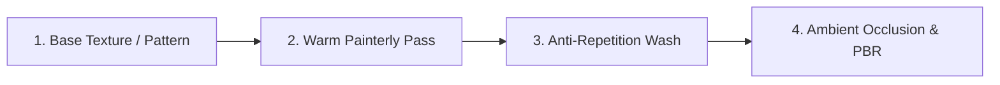

# Materials & Stylized Shading System

This document outlines the material architecture, shader node networks, canonical slot indices, multi-tier texture handling, and draw-call optimization passes in `generator/materials.py`.

---

## 1. Material System Architecture

BlendBuildingCreator uses a **canonical indexed slot system**. Every sub-mesh generator assigns polygon material indices according to predefined constants (`MAT_INDEX_*`). This ensures consistent material assignment across all building types, outbuildings, and castles.

### Canonical Material Index Table (43 Slots)

| Slot Index | Constant | Material Name | Typical Surfaces |
| :---: | :--- | :--- | :--- |
| **0** | `MAT_INDEX_STONE` | `M_Building_Stone` | Primary stone walls, foundation plinths, rough masonry. |
| **1** | `MAT_INDEX_PLASTER` | `M_Building_Plaster` | Exterior and interior plaster wall infill between timbers. |
| **2** | `MAT_INDEX_TIMBER` | `M_Building_Timber` | Structural beams, corner posts, roof rafters, purlins. |
| **3** | `MAT_INDEX_FLOOR` | `M_Building_Floor` | Interior floorboards, ceiling decking, room tiles. |
| **4** | `MAT_INDEX_SHINGLES` | `M_Building_Shingles` | Roof shingles, shake tiles, conical spire cones. |
| **5** | `MAT_INDEX_GLASS` | `M_Building_Glass` | Window panes, bottle glass, stained glass lancets. |
| **6** | `MAT_INDEX_IRON` | `M_Building_Iron` | Strap hinges, portcullis grates, nails, chains, braziers. |
| **7** | `MAT_INDEX_WOOD` | `M_Building_Wood` | Doors, furniture, tables, chairs, railings, benches. |
| **8** | `MAT_INDEX_CUT_STONE` | `M_Building_Cut_Stone` | Dressed stone quoins, door frames, merlons, parapet coping. |
| **9** | `MAT_INDEX_LOG` | `M_Building_Log` | Palisade stakes, peeled log walls. |
| **10** | `MAT_INDEX_LOG_END` | `M_Building_Log_End` | Transverse end grain of cut round logs. |
| **11** | `MAT_INDEX_PLASTER_BRICK` | `M_Building_Plaster_Brick` | Exposed brick patches beneath eroded plaster. |
| **12** | `MAT_INDEX_CLOCK_FACE` | `M_Building_Clock_Face` | Clock dials on civic clock towers and spires. |
| **13** | `MAT_INDEX_BANNER` | `M_Building_Banner` | Cloth standards, pennons, heraldic flags. |
| **14** | `MAT_INDEX_TARGET` | `M_Building_Target` | Concentric red-and-white archery target faces. |
| **15** | `MAT_INDEX_HAY` | `M_Building_Hay` | Training dummy stuffing, thatched roofing, stables. |
| **16** | `MAT_INDEX_DIRT` | `M_Building_Dirt` | Flowerbox soil, courtyard training grounds. |
| **17** | `MAT_INDEX_SIGN` | `M_Building_Sign` | Carved trade signs for taverns, bakeries, blacksmiths. |
| **18** | `MAT_INDEX_ROPE` | `M_Building_Rope` | Crane hoist ropes, scaffolding lashings. |
| **19** | `MAT_INDEX_LANTERN` | `LanternEmissive` | Glowing emissive lantern glass. |
| **20** | `MAT_INDEX_TARP` | `M_Building_Tarp` | Market stall canvas, covered wagons. |
| **21-32**| Various | Leather, book paper, wax, rugs | Book covers, library tomes, candles, interior carpets. |
| **33-40**| Various | Foliage, food, upholstery | Window plants, bread, tavern seating, open spellbooks. |
| **41** | `MAT_INDEX_WATER` | `M_Water` | Courtyard fountains, scrying pools, well water. |
| **42** | `MAT_INDEX_CLIFFS` | `M_Building_Cliffs` | Natural stratified mountain bedrock & cliff terraces. |

---

## 2. Multi-Tier Material Palette

Materials adapt their visual aesthetic based on `props.material_tier`:

| Material Tier | Stone (`MAT_INDEX_STONE`) | Wood / Timber (`MAT_INDEX_TIMBER`) | Roof (`MAT_INDEX_SHINGLES`) |
| :--- | :--- | :--- | :--- |
| **Tier 1 (Rustic)** | Mud stone & rounded boulder fieldstone with dark mortar. | Rough peeled round logs and rough-hewn split timber. | Natural cedar wood shakes with weathered edges. |
| **Tier 2 (Planks)** | Squared fieldstone with thick clay mortar joints. | Sawn flat timber planks with bevelled edges. | Terracotta orange clay tiles. |
| **Tier 3 (Noble/Stone)** | Tight-jointed dressed ashlar masonry in warm sand-tan. | Polished dark oak and fine carved woodwork. | Slate-grey or royal cobalt blue scalloped tiles. |

---

## 3. The 4-Stage Stylized Shading Pipeline

All shaders in `generator/materials.py` pass through a four-stage node network:

### Stage 1: Base Texture or Procedural Fallback
- If diffuse textures exist in `textures/`, `_load_image_texture` loads and maps them.
- If textures are absent, the system constructs **100% procedural node fallbacks** (e.g. Voronoi distance-to-edge for mud stone, procedural brick patterns for ashlar, or warped wave noise for wood grain).

### Stage 2: Warm Painterly Pass (`_warm_painterly_pass`)
Applies subtle high-frequency painterly noise with warm color grading (`#B89475` to `#E8D6B8`) to soften harsh digital lines and simulate hand-painted brushstrokes.

### Stage 3: Anti-Repetition Wash (`_anti_repetition_wash`)
Large continuous surfaces (e.g., $40\text{m}$ castle walls, expansive roof planes) suffer from tiling repetition. The anti-repetition wash introduces broad, low-frequency subtle color modulation across the geometry, breaking up grid patterns naturally.

### Stage 4: Contact AO & PBR Setup (`_apply_ao`, `_setup_pbr`)
- Adds contact ambient occlusion in corners, crevices, and beam intersections.
- Connects to Blender's `Principled BSDF` with non-metallic roughness ($0.65 - 0.92$) and subtle bump mapping.

---

## 4. Specialized Procedural Shaders

### Organic Wood Grain (`_wood_grain_nodes`)
Creates lifelike hand-carved wood grain without barcode stripes:
1. **Coordinate Warp**: Warps UV coordinates using noise to introduce meandering grain flow.
2. **Longitudinal Stretcher**: Scales mapping along $V$ by $0.06$ to simulate elongated timber fibers.
3. **Dual Noise Blend**: Combines primary grain loops with secondary fine fiber noise.
4. **Color Ramp**: Maps from deep bark shadow to warm golden grain highlights.

### Stratified Mountain Cliffs (`create_stylized_cliffs`)
Used exclusively for `MAT_INDEX_CLIFFS` (Slot 42) on castle foundations:
- **Stratified Horizontal Mapping**: Compresses $Z$-scaling relative to $X/Y$ to create stratified rock ledges.
- **Color Palette**: Dark slate fissure crags (`#3D3B40`), weathered bedrock (`#5C5752`), and granite highlights (`#858785`).
- **Relief Bump**: Procedural rock crag height linked to BSDF normal socket for crisp silhouette definition.

---

## 5. Draw-Call Optimization & Export Preparation

### Slot Pruning (`prune_material_slots_for_bmesh`)
Although the generator provides 43 canonical slots, individual buildings rarely use all 43. Before final mesh commit:
1. Scans all polygons in the BMesh and collects unique active material indices.
2. Removes unassigned material slots from `obj.data.materials`.
3. Remaps face indices in memory so no slot gaps exist.
4. Eliminates redundant draw calls when exporting to Unreal Engine, Unity, or Godot.

### Separation by Material (`props.split_by_material`)
When enabled, the generator executes `bpy.ops.mesh.separate(type='MATERIAL')` post-generation. This breaks the building into separate Blender objects (one for logs, one for stone, one for glass, etc.), allowing distinct collisions, physics, or modular material instances in game engines.
