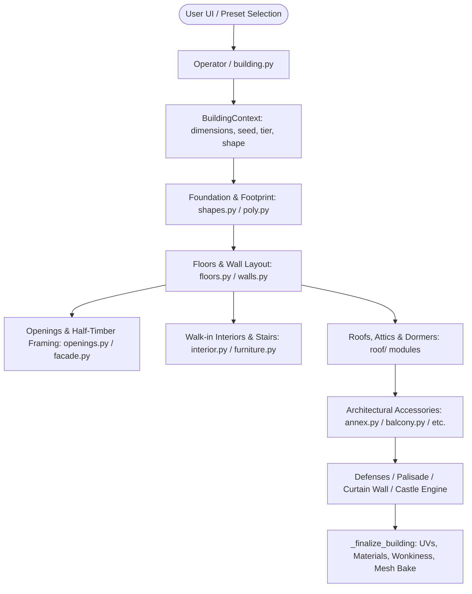

# BlendBuildingCreator — Documentation Hub

Welcome to the comprehensive technical documentation for **BlendBuildingCreator**, a procedural stylized building and fantasy castle generation system for **Blender 5.2 LTS** (4.2+).

---

## 📚 Documentation Index

| Document | Description |
| :--- | :--- |
| **[1. Architecture & Pipeline](ARCHITECTURE_AND_PIPELINE.md)** | Core system design, execution pipeline, coordinate frames, BMesh manipulation, UV unwrapping, and mesh baking. |
| **[2. Builders & Modular Components](BUILDERS_AND_COMPONENTS.md)** | Footprints, walls, half-timber framing, doors, windows, roof archetypes, staircases, interiors, and architectural accessories. |
| **[3. Fortifications & Fantasy Castle System](FORTIFICATIONS_AND_CASTLES.md)** | Defensive curtain walls, gatehouses, bastions, and the multi-tier procedural fantasy castle engine with continuous architectural lineage. |
| **[4. Materials & Stylized Shading](MATERIALS_AND_SHADERS.md)** | The canonical 43-slot material system, hand-painted painterly node networks, procedural fallbacks, anti-repetition washes, and cliff strata. |
| **[5. Presets & Compound Estates](PRESETS_AND_ESTATES.md)** | Guide to all 78 presets across 3 material tiers, outbuilding layouts, training grounds, and estate compound orchestration. |
| **[6. Developer & Contributor Guide](DEVELOPER_GUIDE.md)** | Addon registration, UI panel bindings, headless Blender CLI testing, rendering scripts, and how to create new builders and props. |

---

## 🏛️ System Overview

BlendBuildingCreator is built on the philosophy of **modular procedural orchestration**. Rather than assembling static prefabricated kit pieces or generating hollow monolithic hulls, it programmatically cuts, shapes, and builds full exterior and interior structures:

### Key Capabilities

1. **Walk-Through Interiors by Default**: Every building features physical floor slabs, ceiling beams, partition walls, and functional spiral or switchback staircases with railings.
2. **78 Parametric Presets**: 26 functional archetypes (Civic, Military, Industrial, Residential, Hospitality, Artisan, Estate) available in **Tier 1 (Rustic Logs)**, **Tier 2 (Planks & Timber Frame)**, and **Tier 3 (Cut Stone & Slate)**.
3. **Fortifications & Outer Works**: Enclosing defensive stone curtain walls, palisades, flanking D-bastions with real through-wall arrow slits, functional drawbridges with suspension chains, and gatehouse portcullises.
4. **Procedural Castle Engine**: Multi-district fantasy city-fortress generator with 4-level deep subterranean dungeons, 4 narrative secret routes, skybridges, walkable round towers with strict architectural typology (spires vs flat fighting decks), and layered stylized mountain cliff massifs.
5. **Game Engine Ready**: Canonical material slots, automated slot pruning to minimize draw calls in Unreal Engine/Unity, box UV unwrapping, and optional one-click mesh separation by material.
